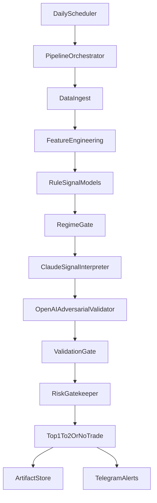

# Multi-Agentic Screener MVP Architecture

## Objective

Build a reliable daily screener that produces `Top1To2` candidates (or explicit `NoTrade`) with traceable evidence, deterministic quant foundations, and controlled LLM reasoning.

## Design Principles

- Deterministic core first: data, features, filters, and regime are pure Python.
- LLMs only interpret and challenge already-computed evidence.
- Every run is auditable with timestamps, run IDs, and stage artifacts.
- No recommendation can bypass validation and risk gating.
- `NoTrade` is a valid and often desirable output.

## System Layers

1. `SchedulingAndOrchestration`
   - Triggers daily run.
   - Creates run context.
   - Coordinates stage execution and persistence.

2. `DeterministicDataIngest`
   - Pulls market/fundamental inputs from providers.
   - Normalizes into common ticker snapshots.

3. `FeatureEngineering`
   - Computes volatility, momentum, liquidity, and relative-strength features.
   - Produces typed feature payloads.

4. `RuleBasedSignalModels`
   - Applies deterministic prefilters.
   - Produces ranked candidate set with model-specific scores.

5. `RegimeGate`
   - Classifies market regime.
   - Removes candidates inconsistent with active regime profile.

6. `AgenticReasoningLayer`
   - `ClaudeSignalInterpreter`: thesis + confidence + invalidation conditions.
   - `OpenAIAdversarialValidator`: counter-thesis + confidence adjustment.
   - `RiskGatekeeper`: approve, veto, or resize.

7. `ValidationGate`
   - Walk-forward assumptions, leakage checks, fragility metrics.
   - Fails closed when assumptions are violated.

8. `OutputAndObservability`
   - Emits final picks, evidence cards, and alert messages.
   - Stores run artifacts and stage traces.

## Runtime Flow

## MVP Boundaries

- In-scope:
  - End-to-end daily run path.
  - Claude + OpenAI overlay.
  - Validation contract + run persistence.
  - Lightweight UI for picks/evidence/history.

- Out-of-scope for MVP:
  - Multi-model meta-routing beyond Claude/OpenAI.
  - Live brokerage integration/execution.
  - Advanced portfolio optimization and OMS.

## Failure Behavior

- If ingest or feature stage fails, return `NoTrade` with system reason.
- If validation fails, recommendation is blocked by default.
- If any LLM call fails, keep deterministic artifacts and emit `NoTrade` unless prior cached analysis is explicitly allowed.
